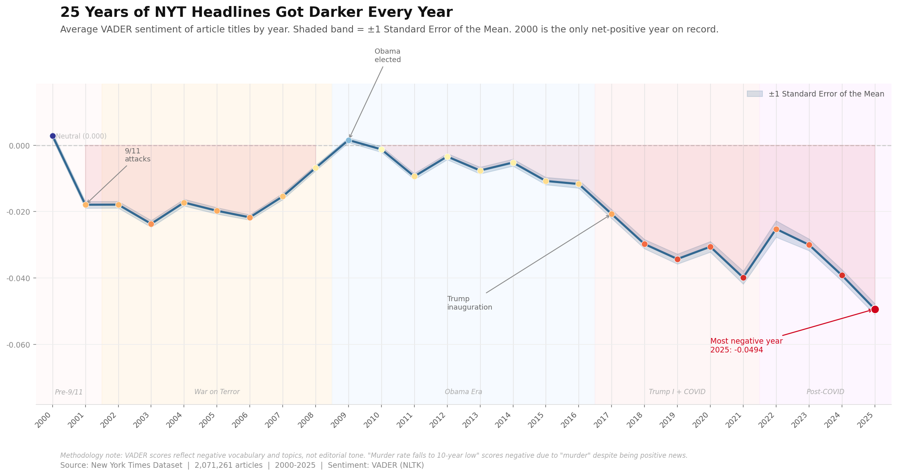
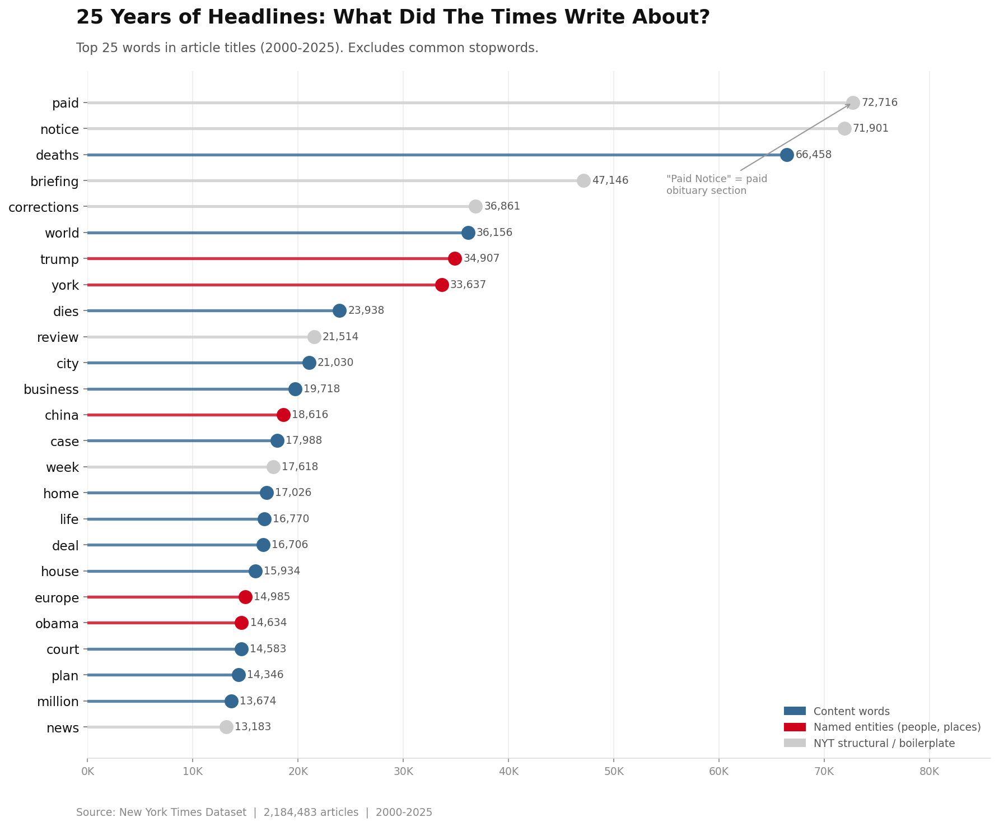
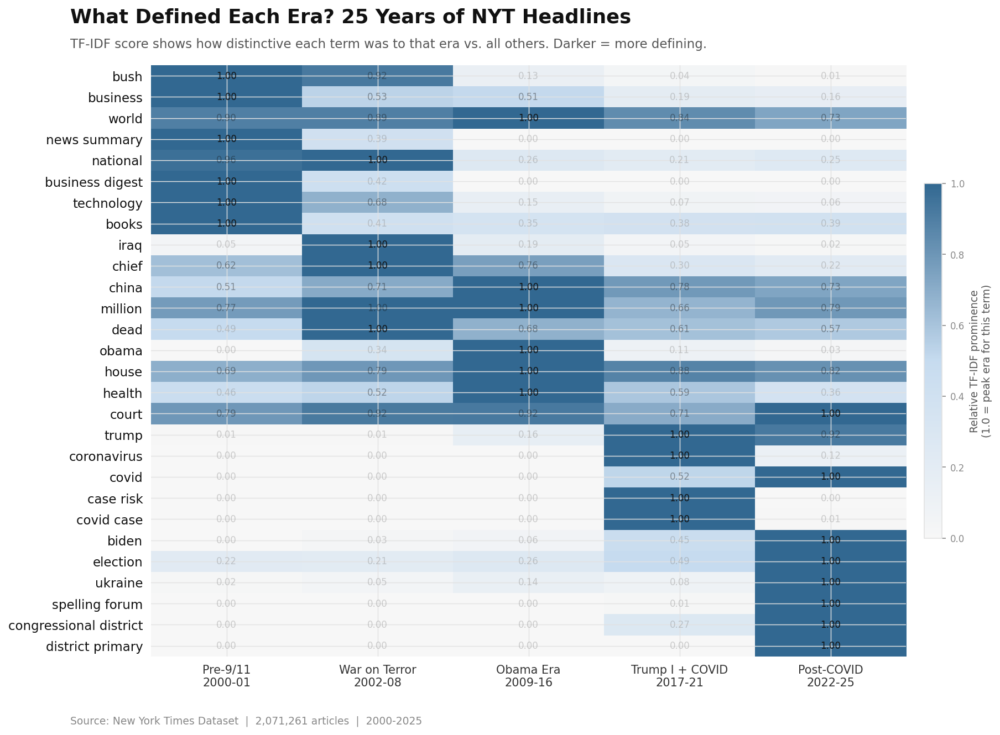
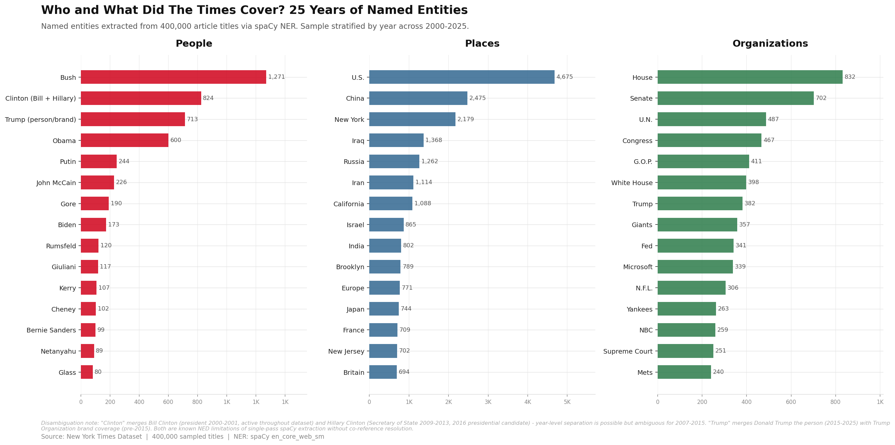
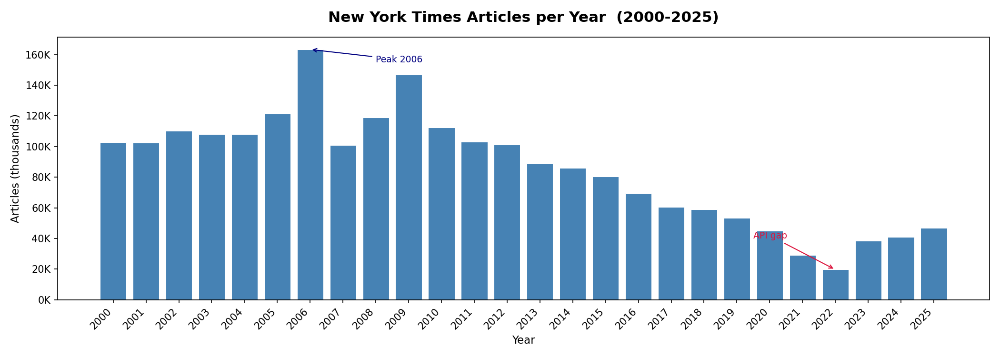

# 25 Years of New York Times Headlines (2000–2025)

An exploratory data-engineering and natural-language-processing project examining how New York Times headline metadata changed from 2000 through 2025.

The analysis covers publishing volume, recurring vocabulary, era-defining terms, lexical sentiment, named entities, and an experimental semantic-search workflow. It analyzes article metadata—primarily publication dates, titles, short descriptions, and URLs—not subscriber, reader, advertising, or other user-level data.

> **Independent project:** This repository is not affiliated with, sponsored by, or endorsed by The New York Times Company. Findings are the author's interpretations of the available dataset and are not statements by The New York Times.

<p align="center">
  
</p>

## Project at a glance

| Item | Scope |
|---|---:|
| Time period | 2000–2025 |
| Rows loaded from the source CSV | 2,216,466 |
| Clean records after deduplication and outlier filtering | 2,184,483 |
| Records after the additional boilerplate-title filter | 2,071,261 |
| Named-entity sample | 400,000 titles, stratified by year |
| Optional semantic-search sample | 50,000 articles |
| Primary environment | Python / Jupyter / Google Colab |

The source CSV is intentionally **not included** in this repository. Anyone reproducing the analysis must obtain article metadata through a source they are authorized to use and comply with all applicable terms.

## Questions explored

- How complete and consistent is the dataset across years?
- Which words dominate the raw headline corpus, and which are publication boilerplate?
- Which terms distinguish the pre-9/11, War on Terror, Obama, Trump/COVID, and post-COVID periods?
- How does headline-level lexical sentiment vary over time?
- Which people, places, and organizations appear most often in a stratified sample?
- Are apparent monthly publishing patterns real, or artifacts of unequal month length and source coverage?
- Can local embeddings and a local language model support semantic retrieval over a sample of the corpus?

## Selected results

### Raw headline vocabulary

Structural terms such as “paid,” “notice,” “briefing,” and “corrections” dominate the unfiltered counts. The chart separates likely publication boilerplate from content words and named entities so the result is not mistaken for a simple topic ranking.

<p align="center">
  
</p>

### Era-distinctive terms

The TF-IDF analysis treats each year as a document, aggregates those scores into five researcher-defined eras, and displays each term relative to its own peak. Darker cells indicate that a term was more distinctive in that era; they do **not** mean that different terms have equal absolute frequency.

<p align="center">
  
</p>

### Named entities

spaCy named-entity recognition was run on a 400,000-title sample stratified by year. The result is useful for exploration but should not be treated as a definitive census: single-pass NER cannot reliably disambiguate every person, organization, or place.

<p align="center">
  
</p>

### Publication coverage

The source contains substantially more records in some years than others. The 2021–2022 decline—especially the 2022 low—is treated as a likely collection or API-coverage gap, not evidence that the newsroom published fewer stories.

<p align="center">
  
</p>

## Repository contents

| Path | Purpose |
|---|---|
| `NYT_analysis_2K_2K5.ipynb` | Main notebook and narrative workflow |
| `nyt_analysis_2k_2k5.py` | Colab-exported Python script |
| `nyt-25-years-medium-article.md` | Long-form project write-up |
| `nyt_articles_per_year.png` | Annual source-coverage audit |
| `nyt_monthly_seasonality.png` | Raw monthly totals |
| `nyt_top_keywords_lollipop.png` | Raw vocabulary with manual categories |
| `nyt_tfidf_era_heatmap.png` | Era-level TF-IDF comparison |
| `nyt_sentiment_trend.png` | Original sentiment chart |
| `nyt_sentiment_trend_v2.png` | Sentiment chart with uncertainty band |
| `nyt_keyword_bump_chart.png` | Yearly keyword rates per 10,000 articles |
| `nyt_ner_entities.png` | Named-entity summary |

Full notebook:

https://github.com/olimiemma/NYT-analysis-2K-2K5/blob/main/NYT_analysis_2K_2K5.ipynb

Long-form write-up:

https://github.com/olimiemma/NYT-analysis-2K-2K5/blob/main/nyt-25-years-medium-article.md

## Data pipeline

1. Load the source CSV and inspect its schema.
2. Parse `date` as UTC, coercing invalid timestamps to missing values.
3. Remove records without a valid date or title.
4. Fill missing short descriptions with empty strings.
5. Drop duplicate URLs.
6. Remove extreme title and description lengths (`title > 300` characters; `short_desc > 1,000` characters).
7. Derive year, month, day-of-week, title length, and description length.
8. Create a second analytical corpus by filtering recurring structural and boilerplate titles.
9. Run frequency, TF-IDF, VADER sentiment, keyword-rate, and sampled NER analyses.
10. Optionally build a local embedding index and retrieval-augmented-generation prototype over a smaller sample.

The workflow deliberately retains two corpus sizes:

- **2,184,483 clean records** for coverage and raw-frequency analysis.
- **2,071,261 filtered records** for analyses that would otherwise be dominated by recurring title templates.

## Expected data schema

The notebook expects a CSV containing at least these fields:

| Column | Meaning |
|---|---|
| `date` | Publication timestamp |
| `title` | Article title or headline |
| `short_desc` | Short description or abstract |
| `url` | Article URL and deduplication key |

Do not commit the raw CSV, credentials, API responses, full article text, or any other content unless you have confirmed that redistribution is permitted.

## Reproducing the core analysis

### 1. Clone the repository

```bash
git clone https://github.com/olimiemma/NYT-analysis-2K-2K5.git
cd NYT-analysis-2K-2K5
```

### 2. Create an environment

```bash
python -m venv .venv
source .venv/bin/activate
python -m pip install --upgrade pip
python -m pip install pandas numpy matplotlib nltk scikit-learn spacy jupyter
python -m spacy download en_core_web_sm
```

On Windows PowerShell, activate the environment with:

```powershell
.venv\Scripts\Activate.ps1
```

### 3. Provide your own lawful data source

The current notebook was developed in Google Colab and expects:

```text
/content/NewYorkTime_2000_2026.csv
```

Upload your authorized CSV to that location in Colab, or replace the hard-coded path before running locally. Keep API keys in environment variables or a secrets manager; never place them in the notebook or commit them to Git.

### 4. Run the notebook in order

```bash
jupyter lab
```

Open `NYT_analysis_2K_2K5.ipynb` and run the cells from top to bottom. NLTK resources are downloaded by the notebook when needed.

### Optional semantic search / RAG

The semantic-search section uses local embeddings, ChromaDB, `llama.cpp`, and a local Gemma-family GGUF model. It is an experimental extension, not part of the minimum reproducible analysis. The exported script assumes model files, GPU-specific installation choices, and embedding setup from the original runtime; update those paths and dependencies for your hardware before running it.

Do not use this dataset or the optional RAG workflow to train, fine-tune, or distribute a model unless your data rights expressly allow that use.

## Tools and techniques

- **Data engineering:** pandas, NumPy, schema inspection, UTC parsing, deduplication, derived date fields, and rule-based quality checks
- **Visualization:** Matplotlib
- **Text analysis:** NLTK stopwords, VADER sentiment, scikit-learn TF-IDF
- **Named entities:** spaCy `en_core_web_sm`
- **Optional retrieval:** dense embeddings, ChromaDB, `llama-cpp-python`, and a local GGUF model
- **Environment:** Jupyter Notebook / Google Colab

## Interpretation limits

These results are descriptive and exploratory.

- **Source coverage is not newsroom output.** Missing or uneven API/data-collection coverage can change counts and trends. The annual chart is a coverage audit, not an official publication ledger.
- **Headline-only analysis is narrow.** Titles and short descriptions do not represent complete articles, editorial intent, reader response, or the full range of journalism published.
- **Sentiment is lexical, not editorial.** VADER reacts to words associated with negative or positive affect. A headline about an improving murder rate can still score negatively because it contains “murder.” The result must not be interpreted as proof of political bias or institutional mood.
- **The uncertainty band is limited.** The standard-error band describes uncertainty around the yearly sample mean; it does not capture model error, source-selection bias, temporal dependence, or headline-template effects.
- **The TF-IDF heatmap is row-normalized.** A value of `1.00` marks a term's peak era, not a universal score comparable across all rows.
- **NER is approximate.** “Clinton” may combine Bill and Hillary Clinton; “Trump” may refer to a person or brand; the small spaCy model does not perform full entity resolution or co-reference resolution.
- **Monthly totals need day normalization.** `nyt_monthly_seasonality.png` shows raw totals, so February is mechanically disadvantaged. Per-day normalization is required before making claims about publishing cadence.
- **Counts and rates answer different questions.** The keyword trend uses mentions per 10,000 articles by year to reduce distortion from uneven yearly coverage.
- **Era boundaries are analytical choices.** They are useful for comparison but are not objective divisions of history.
- **2025 coverage depends on the source snapshot.** Verify completeness before presenting the final year as a full-year comparison.

## Ethical use

- This project analyzes public-facing article metadata, not reader or subscriber data.
- Do not use the outputs to profile individual journalists, readers, or private persons.
- Avoid causal claims about political events, editorial decisions, or institutional bias from descriptive headline statistics alone.
- Preserve links and attribution when presenting examples so readers can inspect the original context where permitted.
- Document filters, exclusions, sampling choices, model versions, and known coverage gaps when extending the analysis.
- Review sensitive named-entity outputs manually before publication.

## Legal, rights, and attribution

This section is a project notice, not legal advice. A README cannot grant rights that the repository owner does not possess or override a data provider's terms.

### New York Times content and API terms

Headlines, short descriptions, article text, URLs, trademarks, and other New York Times materials remain subject to the rights of The New York Times Company and/or the relevant authors and licensors. They are **not** covered by any license that may later be applied to this project's original code.

If you obtain data from The New York Times Developer Network or another NYT service, review and comply with the terms that apply to your account, endpoint, storage, display, attribution, redistribution, and intended use:

https://developer.nytimes.com/

https://developer.nytimes.com/terms

https://help.nytimes.com/hc/en-us/articles/115014893428-Terms-of-service

The repository does not include an NYT API key, the raw CSV, full article text, or a license to republish NYT content. Obtain your own credentials and permission where required. Do not remove copyright notices, bypass access controls, evade rate limits, or use the project as a substitute for an NYT product or subscription.

“The New York Times,” “The Times,” “NYTimes.com,” and related names and logos are trademarks or service marks associated with The New York Times Company. Their use here is solely descriptive and nominative. No NYT logo is included, and no endorsement is claimed.

### Original project materials

Unless a separate `LICENSE` file is added, no open-source license is granted for the original code, prose, or visualizations in this repository. Under the default copyright position, reuse beyond rights supplied by law requires permission from the copyright holder.

Copyright © 2026 Olimi Emmanuel Kasigazi. All rights reserved for original project materials, excluding third-party content and software.

Any future code license should clearly apply only to original code and expressly exclude:

- New York Times content and metadata;
- the source dataset and API responses;
- third-party model weights and tokenizers;
- third-party libraries and assets; and
- names, logos, and trademarks.

Third-party Python packages and models retain their own licenses and terms. Review them before redistribution or commercial use.

### Citation

When referencing this analysis, cite the repository and include the date you accessed it:

```text
Kasigazi, Olimi Emmanuel. “25 Years of New York Times Headlines (2000–2025).”
GitHub repository, 2026.
https://github.com/olimiemma/NYT-analysis-2K-2K5
```

## Corrections and reproducibility reports

If you find a data-quality issue, methodological error, or result you cannot reproduce, open a GitHub issue with:

- the affected notebook cell or script section;
- the package and model versions used;
- the relevant date range and row counts;
- a minimal reproducible example that does not expose credentials or restricted data; and
- the expected and observed results.

Issues:

https://github.com/olimiemma/NYT-analysis-2K-2K5/issues

## Author

Olimi Emmanuel Kasigazi

https://github.com/olimiemma

https://olimiemma.com/


----

This is an independent analytical project and is not affiliated with, sponsored by, or endorsed by The New York Times Company
